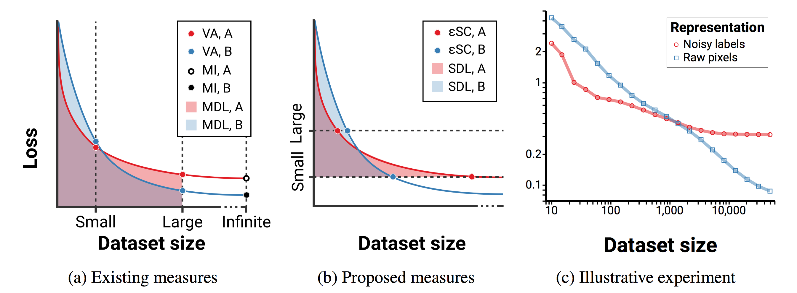

# Evaluating representations

Everybody wants to learn good representations of data. However, defining precisely what we mean by a good representation can be tricky. In a recent paper, we show that many notions of the quality of a representation for a task can be expressed as a function of the _loss-data curve_.



This repo contains a library for computing loss-data curves and the metrics of representation quality that can be derived from them. These metrics are:

- Validation loss
- Mutual information (approximate; a bound only)
- Minimum description length, from [Information-Theoretic Probing with Minimum Description Length](https://arxiv.org/abs/2003.12298)
- Surplus description length (our paper)
- ε-sample complexity (our paper)

We encourage anyone working on representation learning to bring their representations and datasets and use this library for evaluation and benchmarking. Don't settle for evaluating with linear probes or few-shot fine-tuning!


## Features

This library is designed to be framework-agnostic and _extremely_ efficient. Loss-data curves, and the associated measures like MDL and SDL, can be expensive to compute as they require training a probe algorithm dozens of times. This library reduces the time it takes to do this from 30 minutes to 2.

- **Bring your own dataset, representation function, and probe algorithm.** We provide implementations of representation functions such as VAEs and supervised pretraining, and an MLP with Adam probe algorithm, but you can quickly and easily use your own.
- **Framework-agnostic.** You can implement representation functions and algorithms in any framework you choose, be it Pytorch, JAX, NumPy, or TensorFlow. Anything that can convert to and from NumPy arrays is fair game.
- **Extremely fast.** When using probing algorithms implemented in JAX, such as the standard MLP example we include, this library performs _parallel training_ of dozens of networks at a time on a single GPU. Loss-data curves derived from training 100 small networks can be computed in about two minutes on one GPU. Yes, training 100 networks at once on one GPU.
- **Publication-ready output.** The library includes utilities for producing publication-quality plots and tables from the results. It even renders LaTeX tables including all the representation metrics.
- **Simple to use.** You can evaluate your representation according to five measures in only a few lines of code.

## Example

```python
import reprieve

# import a probing algorithm
from reprieve.algorithms import mlp as alg


# make a standard MNIST dataset
dataset_mnist = torchvision.datasets.MNIST(
    './data', train=True, download=True,
    transform=torchvision.transforms.Compose([
        torchvision.transforms.ToTensor(),
        torchvision.transforms.Normalize((0.1307,), (0.3081,))]))

# train a VAE on MNIST with an 8D latent space
representations.mnist_vae.build_repr(8)

# make an MLP classifier algorithm with 8D inputs and 10 classes
# algorithms are represented by an initializer, a training step, and an eval step
init_fn, train_step_fn, eval_fn = alg.make_algorithm((8,), 10)

# construct a LossDataEstimator with this algorithm, dataset, and representation
vae_loss_data_estimator = reprieve.LossDataEstimator(
        init_fn, train_step_fn, eval_fn, dataset_mnist,
        representation_fn=vae_repr)

# compute the loss-data curve
loss_data_df = vae_loss_data_estimator.compute_curve(n_points=args.points)

# compute all the metrics and render the loss-data curve and a LaTeX table of results
metrics_df = reprieve.compute_metrics(loss_data_df,
                                      ns=[1000, 10000], epsilons=[0.5, 0.1])
reprieve.render_curve(loss_data_df, save_path='results.pdf')
reprieve.render_latex(metrics_df, save_path='results.tex')
```


## Installation

### Dependencies

- [Pytorch](https://pytorch.org/get-started/locally/)
- For parallel training: [JAX](https://github.com/google/jax#installation). _Strongly_ recommended.
- For generating and saving charts: [Altair](https://altair-viz.github.io/getting_started/installation.html) and [altair_saver](https://github.com/altair-viz/altair_saver/)
- The standard Python data kit, including numpy and pandas.


## Running experiments


### Custom representations


### Custom algorithms


##
